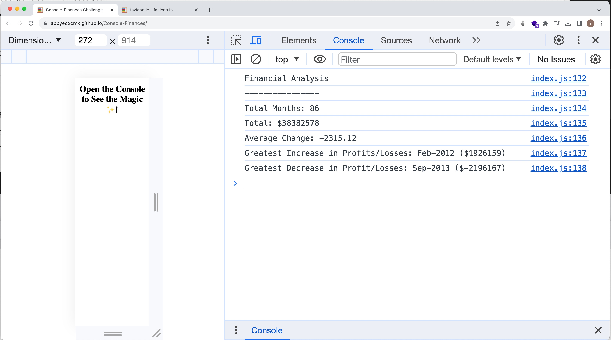

# Unit 4 Challenge: Console Finances



## Overview

In this challenge, we had a real-world situation. We were tasked with creating code in JavaScript for analyzing the financial records of a company.

## Results

This is the final report made by our code:

```
  Financial Analysis 
  ----------------
  Total Months: 86
  Total: $38382578
  Average Change: -2315.12
  Greatest Increase in Profits/Losses: Feb-2012 ($1926159)
  Greatest Decrease in Profits/Losses: Sep-2013 ($-2196167)
```

## Deployment

The page is deployed through GitHub Pages service.

[The link to the GitHub repository](https://github.com/abbyedxcmk/Console-Finances)

[The link to the deployed page](https://abbyedxcmk.github.io/Console-Finances/)


